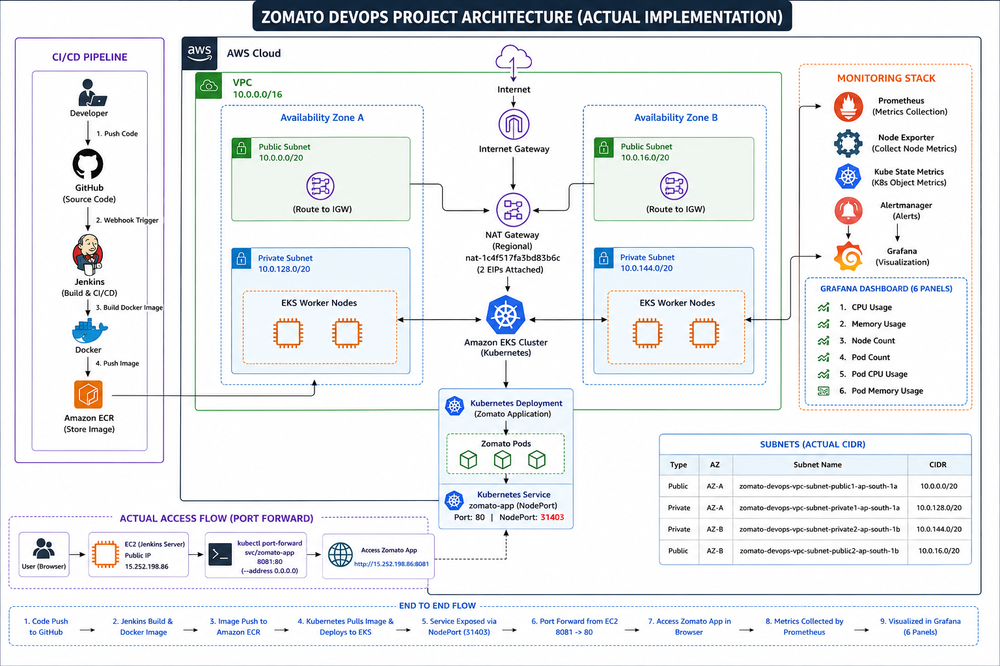

# End-to-End CI/CD Deployment of Zomato Application on AWS EKS

An end-to-end DevOps project that automates the build, containerization, image management, Kubernetes deployment, and monitoring of a Zomato web application on AWS.

## 🏗️ Architecture

**GitHub → Jenkins → Docker → Amazon ECR → Amazon EKS → Kubernetes Service → Zomato Application**

The application is containerized using Docker, stored in Amazon ECR, and deployed on an Amazon EKS cluster running across multiple Availability Zones.

## 🔄 CI/CD Pipeline

- GitHub source code management
- Jenkins source checkout
- Docker image build
- Amazon ECR authentication
- Docker image push to Amazon ECR
- Kubernetes deployment on Amazon EKS
- Kubernetes Service exposure
- Application access through port forwarding

## 🛠️ Technologies

| Category | Technologies |
|---|---|
| Cloud | AWS |
| Source Control | GitHub |
| CI/CD | Jenkins |
| Containerization | Docker |
| Registry | Amazon ECR |
| Orchestration | Kubernetes, Amazon EKS |
| Monitoring | Prometheus, Grafana |
| Metrics | Node Exporter, Kube State Metrics, Metrics Server |
| Alerting | Alertmanager |
| Networking | Amazon VPC, Internet Gateway, NAT Gateway |
| Compute | Amazon EKS Worker Nodes |

## ☸️ Kubernetes

The application is deployed on **Amazon EKS** using Kubernetes resources.

The deployment includes:

- Zomato application Pods
- Kubernetes Deployment
- Kubernetes Service
- NodePort service configuration
- EKS worker nodes distributed across Availability Zones

The Zomato application is exposed using a Kubernetes **NodePort Service** on port `31403`.

For application access during testing, Kubernetes port forwarding is used:

`kubectl port-forward svc/zomato-app 8081:80 --address 0.0.0.0`

The application can then be accessed through the EC2 instance public IP using port `8081`.

## 📊 Monitoring

The Kubernetes environment is monitored using a Prometheus and Grafana monitoring stack.

Prometheus collects infrastructure and Kubernetes metrics using **Node Exporter** and **Kube State Metrics**, while Grafana provides visualization through monitoring dashboards.

### Grafana Panels

- CPU Utilization
- Memory Utilization
- Node Count
- Pod Count
- Pod CPU Usage
- Pod Memory Usage

The monitoring stack also includes:

- Prometheus
- Grafana
- Node Exporter
- Kube State Metrics
- Alertmanager
- Metrics Server

## 🔍 Verification

- Successful GitHub source checkout
- Successful Jenkins build and CI/CD execution
- Docker image successfully built
- Docker image pushed to Amazon ECR
- Amazon EKS cluster successfully created
- EKS worker nodes in Ready state
- Kubernetes Pods in Running/Ready state
- Successful Kubernetes deployment rollout
- Kubernetes Service verified
- NodePort `31403` configured
- Zomato application accessed through browser
- Prometheus successfully collecting metrics
- Monitoring targets verified
- Grafana dashboard created
- Six Grafana monitoring panels verified

## 🧩 Troubleshooting

- Resolved Kubernetes Pod readiness and startup issues.
- Resolved Grafana connectivity and port-forwarding issues.
- Verified Grafana Service endpoints and Pod status.
- Resolved local port conflicts during Kubernetes port forwarding.
- Used an alternate port `8081` for application access when port `8080` was already in use.
- Verified EKS nodes, Pods, Services, and monitoring components using Kubernetes commands.

## 📄 Project Documentation

For the complete step-by-step implementation with AWS screenshots, Kubernetes configuration, CI/CD pipeline, monitoring setup, verification, and troubleshooting:

**[📄 View Project Implementation Report](./Report/Project-3_Zomato_DevOps_Project_Report.pdf)**

## 👩‍💻 Author

**Jeni Balar**

Cloud & DevOps Project
